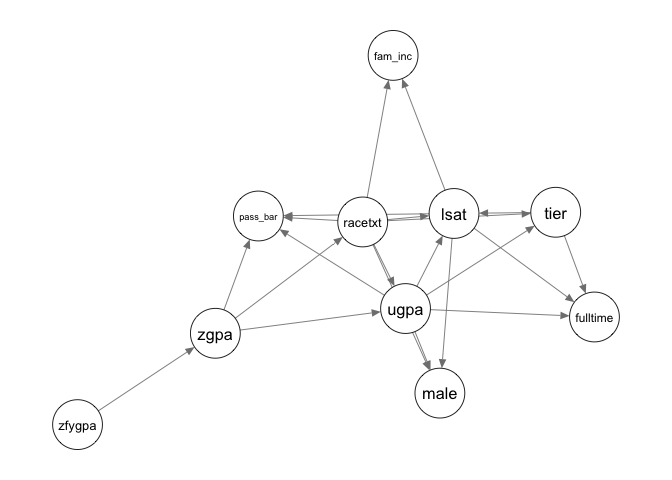

<!-- README.md is generated from README.Rmd. Please edit that file -->

# bnRep 

<!-- badges: start -->
<!-- badges: start -->
<!-- badges: end -->

The R package `bnRep` includes the largest repository of Bayesian
networks, which were all collected from recent academic literature in a
variety of fields! If you are using any Bayesian network from `bnRep`
you should cite:

Leonelli, M (2024). “bnRep: A repository of Bayesian networks from the
academic literature.” ArXiv 24….

    @Article{,
        title = {bn{R}ep: A repository of {B}ayesian networks from the academic literature},
        author = {Manuele Leonelli},
        journal = {Arxiv},
        year = {2024}
      }

Go to (link here) to explore the repository online!

## Contribution

If you are interested in having your Bayesian network included in
`bnRep` you must prepare three objects:

- the Bayesian network as a `bn.fit` object (if not created with
  `bnlearn` you can always use import functions, such as `read.bif()`);

- an R file with the same name of the `bn.fit` object reporting the
  documentation of the Bayesian network;

- a vector/excel file with the required details to include in the
  `bnRep_summary` object.

You can submit the required objects directly via github (e.g fork/pull),
or via email.

If you struggle with any of these steps, please get in touch and I will
try to help!

## Overview

`bnRep` includes over 200 Bayesian networks from more than 150 academic
publications. It includes discrete, Gaussian and conditional linear
Gaussian Bayesian networks, all stored as appropriate `bn.fit` objects
from `bnlearn`. They can be exported for use to other software
(e.g. Phython libraries) using functions from `bnlearn` such as
`write.bif()`. Recall that in order to plot the associated DAG, one must
first convert it to a graph object with `bn.net()` from the `bnlearn`
package.

### Installation

``` r
# Install stable version from CRAN:
install.packages("bnRep")

# Or the development version from GitHub:
remotes::install_github("manueleleonelli/bnRep")
```

### Usage

We will use the `lawschool` Bayesian network as an example. To load it
in the environment simply call `data(lawschool)` and to then plot it
(for instance using `graphviz.plot` from the `bnlearn` package)

``` r
library(bnRep)
library(bnlearn)
library(qgraph)
data("lawschool")
qgraph::qgraph(bn.net(lawschool))
```



Notice that the function `bn.net` function must be used in order to plot
the network.

### Exploring bnRep

`bnRep` includes two features to explore the Bayesian networks in the
repository:

- `bnRep_summary`: a dataframe with important details about each network
  in the repository.

- `bnRep_app`: a Shiny app to interactively explore `bnRep_summary` and
  filter the networks according to various criteria. The app is also
  available online at (link here).

Here’s the columns of `bnRep_summary`:

    #>  [1] "Name"                   "Type"                   "Structure"             
    #>  [4] "Probabilities"          "Graph"                  "Area"                  
    #>  [7] "Nodes"                  "Arcs"                   "Parameters"            
    #> [10] "Avg. Parents"           "Max Parents"            "Avg. Levels"           
    #> [13] "Max Levels"             "Average Markov Blanket" "Year"                  
    #> [16] "Journal"                "Reference"

### An overview of the Bayesian networks in bnRep

The following plots show some summary statistics of the repository.


